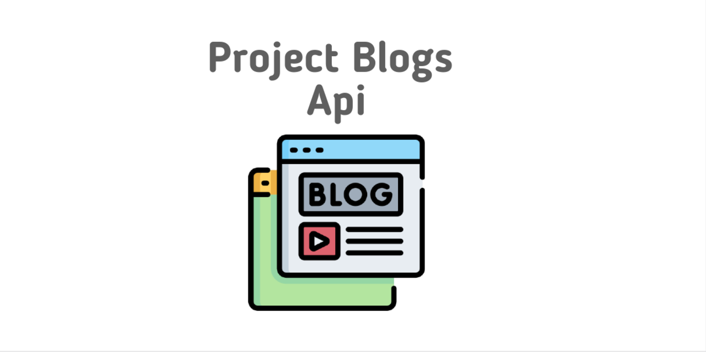
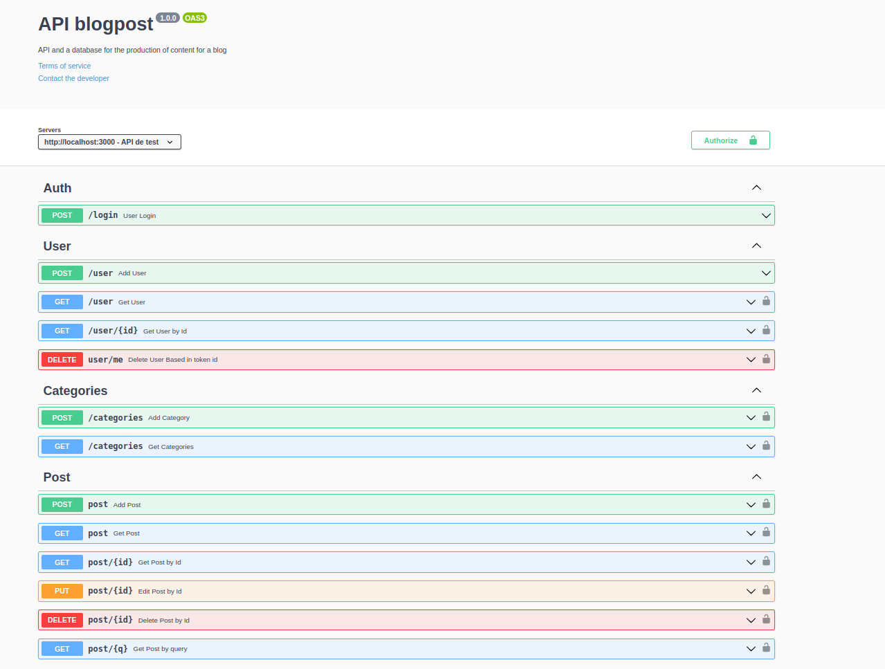

## About

Application in Node.js using the sequelize package to make a CRUD of posts.

Endpoints are connected to a database following Rest principles.

The relationship between user and post is worked, so user and login are required. each post belongs to one or more categories, thus working the relationship between post and category.

Route protection with jwt token is also worked.

## Learnings

* Structuring an application in layer
* Delegate specific responsibilities to this layer
* Understand and apply REST standards
* Write signatures for intuitive and easily understandable APIs.
* work with user authentication with jwt
* validations of data received through joi

## Technologies Used

&nbsp;
&nbsp;
&nbsp;
&nbsp;
&nbsp;

&nbsp;
&nbsp;
&nbsp;


## Installation

* *Clone the repository*

```
git@github.com:SamuelS00/Blogs-Api.git
```

* *After cloning the repository, install the dependencies:*

```
yarn install
```

or

```
npm install
```

* *Then proceed with the creation of your .Env file to store your environment variables, just like:*

```
MYSQL_HOST=localhost
MYSQL_USER=root
MYSQL_PASSWORD=root
MYSQL_DATABASE=blogs_api
PORT=3000
```

### Docker

* *Before you start, your docker-compose needs to be at version 1.29 or higher. See here or in the documentation how to install it. In the first article, you can replace where you are with 1.26.0 with 1.29.2.*
* to run the application containers use the command below:

```
docker exec -it store_manager bash
```

* From here you can run the blogs_api container via CLI or open it in VS Code:

```
docker exec -it blogs_api bash
```

### Usage

* run prestart command to populate the tables in the database:

```
npm run prestart
```

* to run the application use the command below:

```
npm start
```

or

```
yarn test
```

* to run all tests use the command below:

```
npm test
```

### Documentation

* To access the API documentation go to https://localhost:3000/api-docs;


